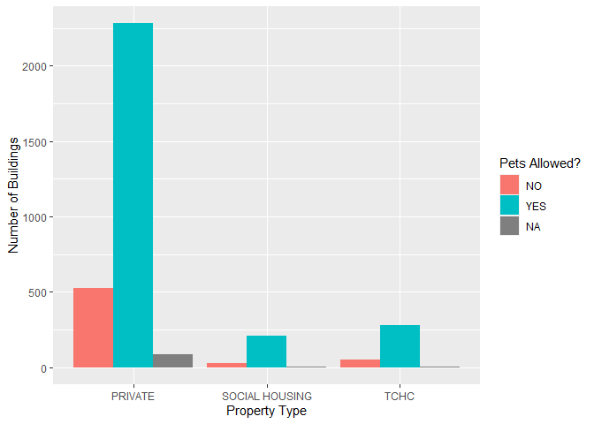
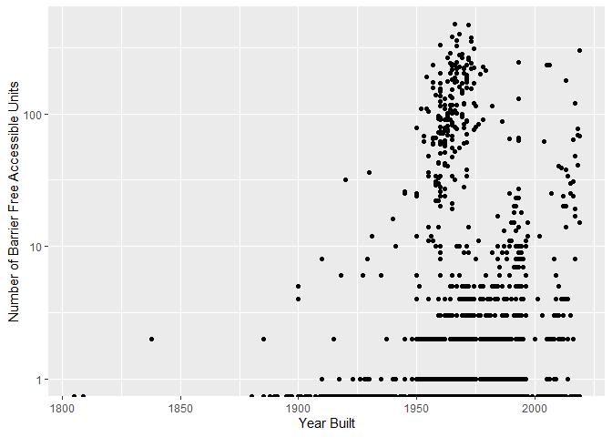
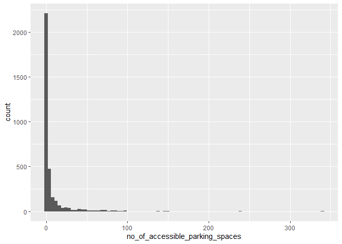
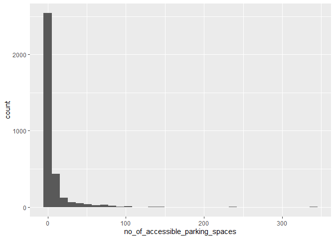
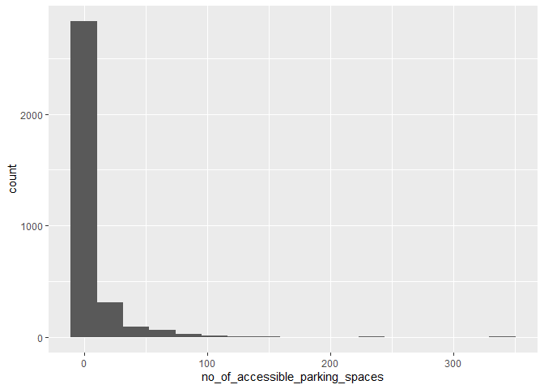
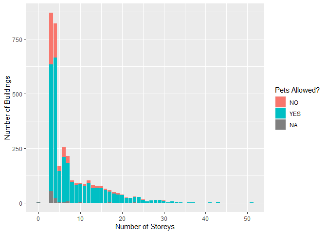

Mini Data Analysis Milestone 2_TB
================
Tiana Broen, 16922171
19/10/2021

### Introduction: This file contains all components of Milestone 2 of the Mini Data Analysis for STAT 545A. In this code, the data *apt_buildings* is further examined and cleaned to produce a reproducible and clear report using R Markdown. The dataset being used is from the *datateachr* package by Hayley Boyce and Jordan Bourak.

# Task 1: Process and summarize your data

## 1.1: Write the 4 research questions you defined in milestone 1.

The four research questions I have chosen to explore using the
“apt_buildings” dataset are: 1. *What property type (i.e. private, TCHC,
Social Housing) is most likely to allow pets?* 2. *Is there a
relationship between the accessibility of apartments and the year they
were built?* 3. *What property type (i.e. private, TCHC, Social Housing)
would be most appropriate for a family (i.e. including child play area,
parking, guest parking, laundry room, and storage)* 4. *Are apartments
that allow pets also more likely to offer parking?*

## 1.2: Choose one task from **Summarizing** and one task from **Graphing** to complete for each of the above four research questions.

### Research Question #1: “What property type is most likely to allow pets?”

**Task 4 from Summarizing:**: Based on two categorical variables,
calculate two summary statistics of your choosing For this task, I am
interested in summary statistics for the “pets_allowed” and
“property_type” categorical variables. First, I want to understand how
many buildings allow/do not allow pets and the number of buildings
belonging to each housing property category (private properties, social
housing properties, or TCHC properties). Next, I count the number of
buildings belonging to each property type that allows pets. This will
allow me to calculate which property type is most likely to allow pets
in my future analyses.

``` r
(pet_friendly_buildings_count <- apt_buildings %>% group_by(pets_allowed) %>%
  summarise(count=n())) #In total, 601 buildings do not allow pets, 2764 buildings allow pets, and 90 do not specify whether or not they allow pets.
```

    ## # A tibble: 3 x 2
    ##   pets_allowed count
    ##   <chr>        <int>
    ## 1 NO             601
    ## 2 YES           2764
    ## 3 <NA>            90

``` r
(property_type_count <- apt_buildings %>% group_by(property_type) %>%
  summarise(count=n())) #In total, 2888 buildings are private properties, 240 buildings are social housing properties, and 327 are TCHC properties (Toronto Community Housing Corporation)
```

    ## # A tibble: 3 x 2
    ##   property_type  count
    ##   <chr>          <int>
    ## 1 PRIVATE         2888
    ## 2 SOCIAL HOUSING   240
    ## 3 TCHC             327

``` r
(pet_friendly_only <- apt_buildings %>% 
    group_by(property_type) %>%
    filter(pets_allowed == "YES") %>%
    summarise(count=n()))#This tells me how many buildings allow pets based on the property type. Based on this summary, the majority of pet friendly buildings are private properties.
```

    ## # A tibble: 3 x 2
    ##   property_type  count
    ##   <chr>          <int>
    ## 1 PRIVATE         2281
    ## 2 SOCIAL HOUSING   207
    ## 3 TCHC             276

**Task 5 from Graphing:** Create a graph out of summarized variables
that has at least two geom layers. I selected a bar graph to represent
the summarized data about “property_type” and “pets_allowed”. The bar
graph allows me to easily visualize the number of pet friendly buildings
in each property type as well as the general ratio of Pets Allowed
vs. Not Allowed vs. NA within each property type.

``` r
ggplot_pet_friendly <- ggplot(data = apt_buildings) + 
  geom_bar(mapping = aes(x = property_type, fill = pets_allowed), position = "dodge") +
  xlab("Property Type") + ylab("Number of Buildings")
(ggplot_pet_friendly + labs(fill="Pets Allowed?"))
```

<!-- -->

### Research Question #2: “Is there a relationship between the accessibility of apartments and the year they were built?”

**Task 1 from Summarizing:**: Compute the *range*, *mean*, and *two
other summary statistics* of **one numerical variable** across the
groups of **one categorical variable** from your data. I am interested
in better understanding the accessibility of buildings and the years
they were built. First, I create a subset of data including buildings
that have “barrier free accessibility entrances”. Next, within this
subset, I calculate four summary statistics for the years these
buildings were built (range, mean, median, sd). This will help me get a
general idea of the years that buildings with accessible entrances were
built.

``` r
accessible <- apt_buildings %>% 
  filter(barrier_free_accessibilty_entr == "YES")

(summary_statistics_year_built <- summary(accessible$year_built))
```

    ##    Min. 1st Qu.  Median    Mean 3rd Qu.    Max.    NA's 
    ##    1838    1962    1969    1972    1980    2019       1

``` r
(sd_year_built <- sd(accessible$year_built, na.rm=TRUE))
```

    ## [1] 17.54428

**Task 7 from Graphing:**: Create a graph of your choosing, make one of
the axes logarithmic, and format the axes labels so that they are
“pretty” or easier to read. I chose to represent the relationship
between number of accessible units and year built using a scatter plot
graph. I made the y-axis logarithmic in order to view the heavily skewed
data more clearly. This allowed me to visualize that most buildings with
a large number of accessible units were built after 1950. However, since
there are several buildings with zero accessible units, the graph
visualization is not very clear. In the future, I could filter my data
to exclude buildings that do not have any accessible units.

``` r
(ggplot_accessible_year_built <- ggplot(data = apt_buildings) + 
  geom_point(mapping = aes(x = year_built, y = no_barrier_free_accessible_units)) +
  scale_y_continuous(trans = 'log10') + xlab("Year Built") + ylab("Number of Barrier Free Accessible Units"))
```

    ## Warning: Transformation introduced infinite values in continuous y-axis

    ## Warning: Removed 155 rows containing missing values (geom_point).

<!-- -->

### Research Question #3: “What property type (i.e. private, TCHC, Social Housing) would be most appropriate for a family (i.e. including child play area, parking, guest parking, laundry room, and storage)?”

**Task 2 from Summarizing:** Compute the *range*, *mean*, and *two other
summary statistics* of **one numerical variable** across the groups of
**one categorical variable** from your data. Since I am interested in
properties that would be appropriate for families, it is important to
understand the amenities, such as parking stalls, available to tenants.
I am interested in the number of accessible parking spaces as it will
tell me whether these properties will facilitate parents that drive
children to school, carpool, or invite other friends over for play
dates. As a starting point, I am interested in the average number of
parking stalls available across all apartment buildings. In future
analyses, I can subset me data based on other criteria a family may have
for a home (ex. laundry room, storage). In this activity, I calculate
range, mean, median, and standard deviation.

``` r
(summary_statistics_no_parking_spaces <- summary(apt_buildings$no_of_accessible_parking_spaces))
```

    ##    Min. 1st Qu.  Median    Mean 3rd Qu.    Max.    NA's 
    ##   0.000   0.000   1.000   6.559   5.000 340.000     123

``` r
(sd_no_parking_spaces <- sd(apt_buildings$no_of_accessible_parking_spaces, na.rm=TRUE))
```

    ## [1] 16.63056

**Task 8 from Graphing:** Create 3 histograms out of summarized
variables, with each histogram having different sized bins. Pick the
“best” one and explain why it is the best. I chose a histogram to
visualize the number of parking stalls available across all apartment
buildings. Since the number of parking stalls ranges from 0-340, I chose
to include bin numbers of the maximum divided by 4 (85), ten (34), and
20 (17). Since the data is very right skewed, including too many bins
makes it difficult to visualize the number of parking stalls available
at smaller increments. I think the lowest bin number (17) is the best
for visualizing the data as it allows you to view the general trend of
the distribution of number of parking stalls, but still understand some
finer details within the general trend (i.e. difference between number
of apartments with 50 vs. 100 parking stalls). In future analyses and
visulaization I could remove outliers from the data to create a more
normal distribution and better reflect the mean of the data on number of
accessible parking stalls.

``` r
ggplot(apt_buildings, aes(no_of_accessible_parking_spaces)) +
  geom_histogram(bins = 85)
```

    ## Warning: Removed 123 rows containing non-finite values (stat_bin).

<!-- -->

``` r
ggplot(apt_buildings, aes(no_of_accessible_parking_spaces)) +
  geom_histogram(bins = 34)
```

    ## Warning: Removed 123 rows containing non-finite values (stat_bin).

<!-- -->

``` r
ggplot(apt_buildings, aes(no_of_accessible_parking_spaces)) +
  geom_histogram(bins = 17) 
```

    ## Warning: Removed 123 rows containing non-finite values (stat_bin).

<!-- -->

### Research Question #4: “Are apartments that allow pets also more likely to offer parking?”

**Task 4:** Based on two categorical variables, calculate two summary
statistics of your choosing. As a dog owner, I was curious if apartments
that allow pets also allow parking for when you need to travel with your
pet. To explore these two categorical variables, I first wanted to
understand the types of parking available across all apartments. I
realized that there are several different combinations of parking types
that are available at apartments. In the future, I could create new
variables for each parking type to count the number of apartments with
each type of parking. For these summary statistics, I chose to create a
dichotomous variable of either “parking available” or “parking not
available” by filtering out apartments with “NA” under *parking type*.
Next, I wanted to better understand the relationship between each
parking type and the pet-friendly status of the buildings by counting
the number of buildings with parking available and pets-allowed.

``` r
apt_buildings %>% group_by(parking_type) %>%
  summarise(count=n())
```

    ## # A tibble: 42 x 2
    ##    parking_type                                                          count
    ##    <chr>                                                                 <int>
    ##  1 Carport                                                                  11
    ##  2 Carport , Parking Deck                                                    1
    ##  3 Carport , Surface Parking                                                70
    ##  4 Carport , Surface Parking , Parking Deck                                  3
    ##  5 Ground Level Garage                                                      74
    ##  6 Ground Level Garage , Carport                                             3
    ##  7 Ground Level Garage , Carport , Surface Parking                          45
    ##  8 Ground Level Garage , Carport , Surface Parking , Parking Deck            3
    ##  9 Ground Level Garage , Garage accessible thru buildg                       5
    ## 10 Ground Level Garage , Garage accessible thru buildg , Surface Parking     3
    ## # ... with 32 more rows

``` r
parking_available <- apt_buildings %>% filter(!is.na(parking_type))

(parking_and_pets <- parking_available %>% 
    filter(pets_allowed == "YES") %>%
    summarise(count=n())) #In total, 2555 buildings are both pet-friendly and offer a form of parking.
```

    ## # A tibble: 1 x 1
    ##   count
    ##   <int>
    ## 1  2555

``` r
apt_buildings %>% summarise(count=n()) #There are a total of 3455 apartment buildings
```

    ## # A tibble: 1 x 1
    ##   count
    ##   <int>
    ## 1  3455

``` r
(parking_and_pets_ratio <- 2555/3455) #73% of all apartments are both pet-friendly and offer parking.
```

    ## [1] 0.739508

**Task 7:** Create a graph out of summarized variables that has at least
two geom layers. Since my fourth research questions was fairly
straightforward, I chose to explore my interest in pet-friendly
buildings more. My research question here is: “What is the relationship
between the pet-friendly status of apartments and number of storeys in
apartment buildings?” I chose a bar graph to visualize this
relationship, however I did not find this visualization particularly
useful. In the future, I may choose to further explore whether buildings
with fewer storeys are more likely to allow pets.

``` r
(ggplot_pets_and_storeys <- ggplot(data = apt_buildings) + 
  geom_bar(mapping = aes(x = no_of_storeys, fill = pets_allowed)) +
  xlab("Number of Storeys") + ylab("Number of Buildings"))
```

<!-- -->

``` r
(ggplot_pets_and_storeys + labs(fill="Pets Allowed?"))
```

<!-- -->

### 1.3

Based on the above operations, I have definitely become closer to
answering my research questions. Specifically, I was able to better
visualize answers to my questions using ggplot2. Above each activity I
have explained my reasoning for each analysis, the challenges I
encountered, and my suggestions for future directions in analyzing and
visualizing my data.

# Task 2: Tidy your data

### 2.1

Since my dataset has over 8 variables, I have chose the following 8
variables to examine for tidy vs. untidy data: 1. fire_alarm 2.
no_of_elevators 3. heating_type 4. pets_allowed 5. property_type 6.
year_registered 7. year_built 8. no_of_units Based on these 8 variables,
my data is tidy. However, some variables not listed above do not meet
the definition of tidy data. For example, the column *parking_type* is
categorical and some rows include several values separated by a “,”. In
order to clean columns like this, I must split the column into multiple
columns so that each column is only one variable. This will also allow
me to create a consistent data structure so that I can better use my
data analyzing tools in the future.

### 2.2

I will untidy the data and re-tidy it, showing a clear before and after.

``` r
tidy_tibble <- apt_buildings %>%
  select(c(fire_alarm, no_of_elevators, heating_type, pets_allowed, property_type,
           year_registered, year_built, no_of_units)) #creating a tibble with the 8 variables I will untidy

#Before untidying:
tidy_apt_buildings <- tidy_tibble

#Untidying.I will pivot wider the *property type* variable, with the values indicating the type of heating. 
(untidy_heating_type <- tidy_apt_buildings %>%
    pivot_wider(names_from = property_type, values_from = heating_type, values_fill = NA))
```

    ## Warning: Values are not uniquely identified; output will contain list-cols.
    ## * Use `values_fn = list` to suppress this warning.
    ## * Use `values_fn = length` to identify where the duplicates arise
    ## * Use `values_fn = {summary_fun}` to summarise duplicates

    ## # A tibble: 2,749 x 9
    ##    fire_alarm no_of_elevators pets_allowed year_registered year_built
    ##    <chr>                <dbl> <chr>                  <dbl>      <dbl>
    ##  1 YES                      3 YES                     2017       1967
    ##  2 YES                      3 YES                     2017       1970
    ##  3 YES                      0 YES                     2017       1927
    ##  4 YES                      1 YES                     2017       1959
    ##  5 YES                      0 YES                     2017       1943
    ##  6 YES                      0 YES                       NA       1952
    ##  7 YES                      0 YES                     2017       1959
    ##  8 YES                      2 YES                     2017       1971
    ##  9 YES                      4 YES                     2017       1969
    ## 10 YES                      2 YES                     2017       1972
    ## # ... with 2,739 more rows, and 4 more variables: no_of_units <dbl>,
    ## #   PRIVATE <list>, TCHC <list>, SOCIAL HOUSING <list>

``` r
untidy_heating_type %>%
  unnest
```

    ## Warning: `cols` is now required when using unnest().
    ## Please use `cols = c(PRIVATE, TCHC, `SOCIAL HOUSING`)`

    ## # A tibble: 3,427 x 9
    ##    fire_alarm no_of_elevators pets_allowed year_registered year_built
    ##    <chr>                <dbl> <chr>                  <dbl>      <dbl>
    ##  1 YES                      3 YES                     2017       1967
    ##  2 YES                      3 YES                     2017       1970
    ##  3 YES                      0 YES                     2017       1927
    ##  4 YES                      1 YES                     2017       1959
    ##  5 YES                      1 YES                     2017       1959
    ##  6 YES                      1 YES                     2017       1959
    ##  7 YES                      0 YES                     2017       1943
    ##  8 YES                      0 YES                       NA       1952
    ##  9 YES                      0 YES                     2017       1959
    ## 10 YES                      0 YES                     2017       1959
    ## # ... with 3,417 more rows, and 4 more variables: no_of_units <dbl>,
    ## #   PRIVATE <chr>, TCHC <chr>, SOCIAL HOUSING <chr>

``` r
#Re-tidying
(tidy_heating_type <- untidy_heating_type %>%
    pivot_longer(cols = c('PRIVATE', 'TCHC', 'SOCIAL HOUSING'), names_to = "property_type",
                 values_to = "heating_type"))
```

    ## # A tibble: 8,247 x 8
    ##    fire_alarm no_of_elevators pets_allowed year_registered year_built
    ##    <chr>                <dbl> <chr>                  <dbl>      <dbl>
    ##  1 YES                      3 YES                     2017       1967
    ##  2 YES                      3 YES                     2017       1967
    ##  3 YES                      3 YES                     2017       1967
    ##  4 YES                      3 YES                     2017       1970
    ##  5 YES                      3 YES                     2017       1970
    ##  6 YES                      3 YES                     2017       1970
    ##  7 YES                      0 YES                     2017       1927
    ##  8 YES                      0 YES                     2017       1927
    ##  9 YES                      0 YES                     2017       1927
    ## 10 YES                      1 YES                     2017       1959
    ## # ... with 8,237 more rows, and 3 more variables: no_of_units <dbl>,
    ## #   property_type <chr>, heating_type <list>

``` r
tidy_heating_type %>%
  unnest
```

    ## Warning: `cols` is now required when using unnest().
    ## Please use `cols = c(heating_type)`

    ## # A tibble: 3,455 x 8
    ##    fire_alarm no_of_elevators pets_allowed year_registered year_built
    ##    <chr>                <dbl> <chr>                  <dbl>      <dbl>
    ##  1 YES                      3 YES                     2017       1967
    ##  2 YES                      3 YES                     2017       1970
    ##  3 YES                      0 YES                     2017       1927
    ##  4 YES                      1 YES                     2017       1959
    ##  5 YES                      1 YES                     2017       1959
    ##  6 YES                      1 YES                     2017       1959
    ##  7 YES                      0 YES                     2017       1943
    ##  8 YES                      0 YES                       NA       1952
    ##  9 YES                      0 YES                     2017       1959
    ## 10 YES                      0 YES                     2017       1959
    ## # ... with 3,445 more rows, and 3 more variables: no_of_units <dbl>,
    ## #   property_type <chr>, heating_type <chr>

### 2.3

The two questions I am choosing to move forward with are: 1. *Is there a
relationship between the accessibility of apartments and the year they
were built?* I chose this question because I was not able to fully it in
the above analyses. After exploring the data for this question I also
understand that I can explore more about the accessibility of apartment
buildings, such as accessible parking spaces and number of storeys in
the building. 2. *What property type (i.e. private, TCHC, Social
Housing) would be most appropriate for a family (i.e. including child
play area, parking, guest parking, laundry room, and storage)* I am
choosing to further explore this question because there are several more
relationships I can examine to determine the most appropriate property
type for a family. There are several requirements that families may look
for in housing, and I can explore these requirements both separately and
in relation to one another.

I will choose an appropriate version of my data to answer these two
questions below

``` r
(apt_buildings_final <- apt_buildings[c(1:3, 5, 6, 12:16, 18, 25, 30, 34, 37)]) #dropping irrelevant columns
```

    ## # A tibble: 3,455 x 15
    ##       id air_conditioning amenities  barrier_free_acc~ bike_parking laundry_room
    ##    <dbl> <chr>            <chr>      <chr>             <chr>        <chr>       
    ##  1 10359 NONE             Outdoor r~ YES               0 indoor pa~ YES         
    ##  2 10360 NONE             Outdoor p~ NO                0 indoor pa~ YES         
    ##  3 10361 NONE             <NA>       NO                Not Availab~ YES         
    ##  4 10362 NONE             <NA>       YES               Not Availab~ YES         
    ##  5 10363 NONE             <NA>       NO                12 indoor p~ YES         
    ##  6 10364 NONE             <NA>       NO                Not Availab~ YES         
    ##  7 10365 NONE             <NA>       YES               Not Availab~ YES         
    ##  8 10366 CENTRAL AIR      Indoor po~ NO                Not Availab~ YES         
    ##  9 10367 NONE             <NA>       YES               0 indoor pa~ YES         
    ## 10 10368 NONE             Indoor re~ YES               Not Availab~ YES         
    ## # ... with 3,445 more rows, and 9 more variables: locker_or_storage_room <chr>,
    ## #   no_of_elevators <dbl>, parking_type <chr>, pets_allowed <chr>,
    ## #   property_type <chr>, visitor_parking <chr>, no_of_storeys <dbl>,
    ## #   no_of_accessible_parking_spaces <dbl>,
    ## #   no_barrier_free_accessible_units <dbl>

``` r
(apt_buildings_final %>% filter(no_barrier_free_accessible_units > 0, na.rm=TRUE)) #Filtering out any buildings that do not offer barrier free accessible units as this is important for both of my above research questions.
```

    ## # A tibble: 919 x 15
    ##       id air_conditioning amenities   barrier_free_ac~ bike_parking laundry_room
    ##    <dbl> <chr>            <chr>       <chr>            <chr>        <chr>       
    ##  1 10359 NONE             Outdoor re~ YES              0 indoor pa~ YES         
    ##  2 10362 NONE             <NA>        YES              Not Availab~ YES         
    ##  3 10365 NONE             <NA>        YES              Not Availab~ YES         
    ##  4 10368 NONE             Indoor rec~ YES              Not Availab~ YES         
    ##  5 10369 NONE             <NA>        YES              Not Availab~ YES         
    ##  6 10377 CENTRAL AIR      Indoor poo~ YES              Not Availab~ YES         
    ##  7 10384 NONE             <NA>        YES              Not Availab~ YES         
    ##  8 10385 NONE             <NA>        YES              Not Availab~ YES         
    ##  9 10387 NONE             <NA>        YES              Not Availab~ YES         
    ## 10 10388 NONE             Outdoor po~ YES              Not Availab~ YES         
    ## # ... with 909 more rows, and 9 more variables: locker_or_storage_room <chr>,
    ## #   no_of_elevators <dbl>, parking_type <chr>, pets_allowed <chr>,
    ## #   property_type <chr>, visitor_parking <chr>, no_of_storeys <dbl>,
    ## #   no_of_accessible_parking_spaces <dbl>,
    ## #   no_barrier_free_accessible_units <dbl>

``` r
(apt_buildings_final %>% rename(
  accessible_units = no_barrier_free_accessible_units,
  storage_available = locker_or_storage_room,
  accessible_entrance = barrier_free_accessibilty_entr)) #Re-naming columns so that they make more sense for future analyses
```

    ## # A tibble: 3,455 x 15
    ##       id air_conditioning amenities   accessible_entr~ bike_parking laundry_room
    ##    <dbl> <chr>            <chr>       <chr>            <chr>        <chr>       
    ##  1 10359 NONE             Outdoor re~ YES              0 indoor pa~ YES         
    ##  2 10360 NONE             Outdoor po~ NO               0 indoor pa~ YES         
    ##  3 10361 NONE             <NA>        NO               Not Availab~ YES         
    ##  4 10362 NONE             <NA>        YES              Not Availab~ YES         
    ##  5 10363 NONE             <NA>        NO               12 indoor p~ YES         
    ##  6 10364 NONE             <NA>        NO               Not Availab~ YES         
    ##  7 10365 NONE             <NA>        YES              Not Availab~ YES         
    ##  8 10366 CENTRAL AIR      Indoor poo~ NO               Not Availab~ YES         
    ##  9 10367 NONE             <NA>        YES              0 indoor pa~ YES         
    ## 10 10368 NONE             Indoor rec~ YES              Not Availab~ YES         
    ## # ... with 3,445 more rows, and 9 more variables: storage_available <chr>,
    ## #   no_of_elevators <dbl>, parking_type <chr>, pets_allowed <chr>,
    ## #   property_type <chr>, visitor_parking <chr>, no_of_storeys <dbl>,
    ## #   no_of_accessible_parking_spaces <dbl>, accessible_units <dbl>

``` r
(apt_buildings_final %>% drop_na()) #Dropping all rows containing missing values as they will make it difficult to fully answer my research questions.
```

    ## # A tibble: 898 x 15
    ##       id air_conditioning amenities   barrier_free_ac~ bike_parking laundry_room
    ##    <dbl> <chr>            <chr>       <chr>            <chr>        <chr>       
    ##  1 10359 NONE             Outdoor re~ YES              0 indoor pa~ YES         
    ##  2 10360 NONE             Outdoor po~ NO               0 indoor pa~ YES         
    ##  3 10366 CENTRAL AIR      Indoor poo~ NO               Not Availab~ YES         
    ##  4 10368 NONE             Indoor rec~ YES              Not Availab~ YES         
    ##  5 10373 NONE             Indoor rec~ NO               Not Availab~ YES         
    ##  6 10377 CENTRAL AIR      Indoor poo~ YES              Not Availab~ YES         
    ##  7 10386 NONE             Indoor exe~ NO               12 indoor p~ YES         
    ##  8 10388 NONE             Outdoor po~ YES              Not Availab~ YES         
    ##  9 10392 CENTRAL AIR      Indoor rec~ YES              71 indoor p~ YES         
    ## 10 10395 NONE             Outdoor po~ NO               Not Availab~ YES         
    ## # ... with 888 more rows, and 9 more variables: locker_or_storage_room <chr>,
    ## #   no_of_elevators <dbl>, parking_type <chr>, pets_allowed <chr>,
    ## #   property_type <chr>, visitor_parking <chr>, no_of_storeys <dbl>,
    ## #   no_of_accessible_parking_spaces <dbl>,
    ## #   no_barrier_free_accessible_units <dbl>
