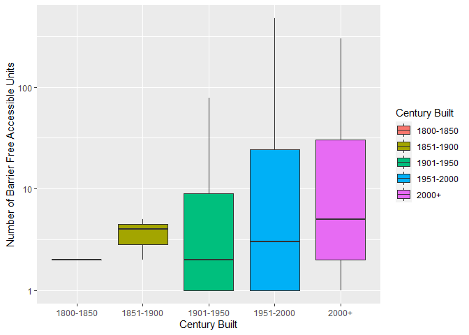
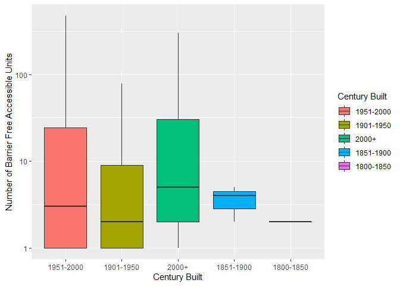
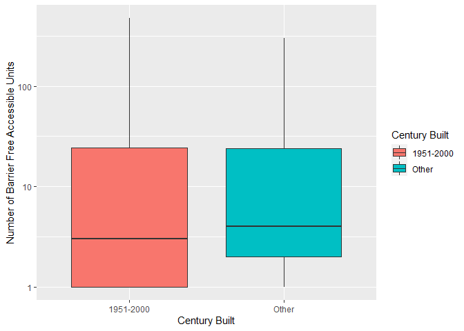

Milestone_3\_TB
================
Tiana Broen, 16922171
27/10/2021

##### Introduction: This file contains all components of Milestone 3 of the Mini Data Analysis for STAT 545A. In this code, the data *apt_buildings* is further examined and cleaned to produce a reproducible and clear report using R Markdown. The dataset being used is from the *datateachr* package by Hayley Boyce and Jordan Bourak.

The two research questions I will be examining from Milestone 2 are:  
1. Is there a relationship between the accessibility of apartments and
the year they were built?  
2. What property type (i.e. private, TCHC, Social Housing) would be most
appropriate for a family (i.e. including child play area, parking, guest
parking, laundry room, and storage)

## Exercise 1: Special Data Types

I will use the following plot from Milestone 2 to complete tasks 1 & 2.
The plot below examines the relationship between the year an apartment
building was built and the number of accessible units in that building.
In order to make this graph more applicable for this exercise, I have
grouped the “year built” variable into “century built” and transformed
it into a factor.

``` r
apt_buildings_1 <- apt_buildings[c('year_built', 'no_barrier_free_accessible_units')] #new dataframe with only the variables I need for this exercise
apt_buildings_1
```

    ## # A tibble: 3,455 x 2
    ##    year_built no_barrier_free_accessible_units
    ##         <dbl>                            <dbl>
    ##  1       1967                                2
    ##  2       1970                                0
    ##  3       1927                                0
    ##  4       1959                               42
    ##  5       1943                                0
    ##  6       1952                               NA
    ##  7       1959                               14
    ##  8       1971                                0
    ##  9       1969                                0
    ## 10       1972                                1
    ## # ... with 3,445 more rows

``` r
apt_buildings_1$century_built <- apt_buildings_1$year_built
apt_buildings_1 <- filter(apt_buildings_1, !is.na(year_built))
apt_buildings_1 <- filter(apt_buildings_1, !is.na(no_barrier_free_accessible_units))

# transforming year built into century built
apt_buildings_1$century_built[c(apt_buildings_1$century_built > 1800 & apt_buildings_1$century_built <= 1850)] <- "1800-1850"
apt_buildings_1$century_built[c(apt_buildings_1$century_built > 1850 & apt_buildings_1$century_built <= 1900)] <- "1851-1900"
apt_buildings_1$century_built[apt_buildings_1$century_built > 1900 & apt_buildings_1$century_built <= 1950] <- "1901-1950"
apt_buildings_1$century_built[c(apt_buildings_1$century_built > 1950 & apt_buildings_1$century_built <= 2000)] <- "1951-2000"
apt_buildings_1$century_built[apt_buildings_1$century_built > 2000] <- "2000+"
apt_buildings_1$century_built <- as.factor(apt_buildings_1$century_built)

#building box plot for tasks 1&2 below
(ggplot_1 <- ggplot(apt_buildings_1, aes(x=century_built, y=no_barrier_free_accessible_units, group=century_built)) +
  geom_boxplot(aes(fill=century_built)) + scale_y_continuous(trans='log10') +
    xlab("Century Built") + ylab("Number of Barrier Free Accessible Units") + labs(fill="Century Built"))
```

<!-- -->

### Task 1: Produce a new plot that reorders a factor in your original plot.

``` r
(ggplot_2 <- apt_buildings_1 %>%
  mutate(century_built = fct_infreq(century_built)) %>%
  ggplot(aes(x=century_built, y=no_barrier_free_accessible_units, group=century_built)) +
  geom_boxplot(aes(fill=century_built)) + scale_y_continuous(trans='log10') +
    xlab("Century Built") + ylab("Number of Barrier Free Accessible Units") + labs(fill="Century Built"))
```

<!-- --> I
chose to reorder the factor “century built”. I chose to reorder this in
by infrequency, meaning I ordered this factor by the frequency in which
it appears (i.e. most apartment buildings are built between 1951-2000,
the fewest were built in the 1800-1850). This adds another layer of
understanding to this plot as you can tell by a glance that although
most apartment buildings were built in the 90s, more buildings were
built in the 2000s with accessibility in mind.

### Task 2: Produce a new plot that groups some factor levels together into an “other” category.

``` r
(ggplot_3 <- apt_buildings_1 %>%
   mutate(century_built = fct_infreq(century_built)) %>%
  mutate(century_built = fct_lump(century_built, n=1, w=NULL, other_level = "Other", ties.method = "min")) %>%
  ggplot(aes(x=century_built, y=no_barrier_free_accessible_units, group=century_built)) +
  geom_boxplot(aes(fill=century_built)) + scale_y_continuous(trans='log10') +
    xlab("Century Built") + ylab("Number of Barrier Free Accessible Units") + labs(fill="Century Built"))
```

<!-- --> I
chose to lump together the factors that showed up the least frequently
in my data. This graph shows me that the majority of the buildings were
built between 1951 and 2000. However, the average number of accessible
units is slightly greater when you combine all other years into one
factor.

## Exercise 2: Modelling

### 2.0: Pick a research question, and pick a variable of interest that’s relevant to the research question.

**Research question**: Is there a relationship between the accessibility
of apartments and the year they were built? **Variable of interest**: My
variable of interest is: “number of barrier free accessible units”.

### 2.1: Fit a model or run a hypothesis test that provides insight on this variable with respect to the research question.

``` r
model_1 <- lm(formula = no_barrier_free_accessible_units ~ year_built, data = apt_buildings)
model_1
```

    ## 
    ## Call:
    ## lm(formula = no_barrier_free_accessible_units ~ year_built, data = apt_buildings)
    ## 
    ## Coefficients:
    ## (Intercept)   year_built  
    ##   -389.2305       0.2031

### 2.2: Produce something relevant from your fitted model.

``` r
(glance(model_1))
```

    ## # A tibble: 1 x 12
    ##   r.squared adj.r.squared sigma statistic    p.value    df  logLik    AIC    BIC
    ##       <dbl>         <dbl> <dbl>     <dbl>      <dbl> <dbl>   <dbl>  <dbl>  <dbl>
    ## 1   0.00942       0.00911  39.4      31.3    2.34e-8     1 -16807. 33620. 33638.
    ## # ... with 3 more variables: deviance <dbl>, df.residual <int>, nobs <int>

I chose to use the *broom* function *glance*. This gives me several
pieces of information related to the model fit. Specifically, I was
interested in the *r.squared* column. The *r.squared* column tells me
how fitted the data is to the regression line; in this case, my data is
not very closely fitted (0.009). So, this indicates that the
relationship between number of barrier free accessible units and year
built is not represented well by my above model. In the future, I should
create a better fitting model (i.e. exclude outliers, look at
correlation coefficients to understand my data better) to get more
meaningful results.

## Exercise 3: Reading and writing data

``` r
dir.create(here::here("C:\\Users\\tiana\\OneDrive\\Desktop\\output"))
```

### 3.1 (5 points)

``` r
# Reformatting my summary table from Milestone 2, exercise 1.2
apt_buildings_na <- filter(apt_buildings, !is.na(year_built))
apt_buildings_na <- filter(apt_buildings_na, !is.na(no_barrier_free_accessible_units))
apt_buildings_na
```

    ## # A tibble: 3,300 x 37
    ##       id air_conditioning amenities    balconies barrier_free_acc~ bike_parking 
    ##    <dbl> <chr>            <chr>        <chr>     <chr>             <chr>        
    ##  1 10359 NONE             Outdoor rec~ YES       YES               0 indoor par~
    ##  2 10360 NONE             Outdoor pool YES       NO                0 indoor par~
    ##  3 10361 NONE             <NA>         YES       NO                Not Available
    ##  4 10362 NONE             <NA>         YES       YES               Not Available
    ##  5 10363 NONE             <NA>         NO        NO                12 indoor pa~
    ##  6 10365 NONE             <NA>         NO        YES               Not Available
    ##  7 10366 CENTRAL AIR      Indoor pool~ YES       NO                Not Available
    ##  8 10367 NONE             <NA>         YES       YES               0 indoor par~
    ##  9 10368 NONE             Indoor recr~ YES       YES               Not Available
    ## 10 10369 NONE             <NA>         NO        YES               Not Available
    ## # ... with 3,290 more rows, and 31 more variables: exterior_fire_escape <chr>,
    ## #   fire_alarm <chr>, garbage_chutes <chr>, heating_type <chr>, intercom <chr>,
    ## #   laundry_room <chr>, locker_or_storage_room <chr>, no_of_elevators <dbl>,
    ## #   parking_type <chr>, pets_allowed <chr>, prop_management_company_name <chr>,
    ## #   property_type <chr>, rsn <dbl>, separate_gas_meters <chr>,
    ## #   separate_hydro_meters <chr>, separate_water_meters <chr>,
    ## #   site_address <chr>, sprinkler_system <chr>, visitor_parking <chr>, ...

``` r
sumstat <- apt_buildings_na %>%
    select(
        `Year Built` = year_built,
        `Number of Accessible Units` = no_barrier_free_accessible_units
        ) %>%
  summarise_each(funs(mean, sd, min, max)) %>%
    gather(key, value, everything()) %>% 
    separate(key, into = c("variable", "stat"), sep = "_") %>%
    spread(stat, value) %>%
    select(variable, mean, sd, min, max) %>%
    mutate_each(funs(round(., 1)), -variable)
sumstat
```

    ## # A tibble: 2 x 5
    ##   variable                     mean    sd   min   max
    ##   <chr>                       <dbl> <dbl> <dbl> <dbl>
    ## 1 Number of Accessible Units    9.4  39.6     0   474
    ## 2 Year Built                 1962.   18.9  1805  2019

``` r
sumstat_df <- as.data.frame(describe(sumstat)) #formatting sumstat_df as a dataframe to export to .csv file
sumstat_df
```

    ##           vars n    mean           sd  median trimmed        mad   min    max
    ## variable*    1 2    1.50    0.7071068    1.50    1.50    0.74130   1.0    2.0
    ## mean         2 2  985.95 1381.0502543  985.95  985.95 1447.83303   9.4 1962.5
    ## sd           3 2   29.25   14.6371104   29.25   29.25   15.34491  18.9   39.6
    ## min          4 2  902.50 1276.3277400  902.50  902.50 1338.04650   0.0 1805.0
    ## max          5 2 1246.50 1092.4799769 1246.50 1246.50 1145.30850 474.0 2019.0
    ##            range          skew kurtosis     se
    ## variable*    1.0  0.000000e+00    -2.75   0.50
    ## mean      1953.1 -4.525657e-17    -2.75 976.55
    ## sd          20.7  0.000000e+00    -2.75  10.35
    ## min       1805.0  0.000000e+00    -2.75 902.50
    ## max       1545.0  0.000000e+00    -2.75 772.50

``` r
write_csv(sumstat_df, here::here("output", "sumstat_df_exported_file.csv"))
dir(here::here("output"))
```

    ## [1] "model_1.rds"                  "sumstat_df_exported_file.csv"

### 3.2: Write your model object from Exercise 2 to an R binary file (an RDS), and load it again.

``` r
saveRDS(model_1, here::here("output", "model_1.rds"))
Model_1_rds <- readRDS(here::here("output", "model_1.rds"))
dir(here::here("output"))
```

    ## [1] "model_1.rds"                  "sumstat_df_exported_file.csv"

``` r
Model_1_rds
```

    ## 
    ## Call:
    ## lm(formula = no_barrier_free_accessible_units ~ year_built, data = apt_buildings)
    ## 
    ## Coefficients:
    ## (Intercept)   year_built  
    ##   -389.2305       0.2031

## Output (2 points)

All output is recent and relevant:

-   All Rmd files have been `knit`ted to their output, and all data
    files saved from Exercise 3 above appear in the `output` folder.
-   All of these output files are up-to-date – that is, they haven’t
    fallen behind after the source (Rmd) files have been updated.
-   There should be no relic output files. For example, if you were
    knitting an Rmd to html, but then changed the output to be only a
    markdown file, then the html file is a relic and should be deleted.

Our recommendation: delete all output files, and re-knit each
milestone’s Rmd file, so that everything is up to date and relevant.

PS: there’s a way where you can run all project code using a single
command, instead of clicking “knit” three times. More on this in STAT
545B!
